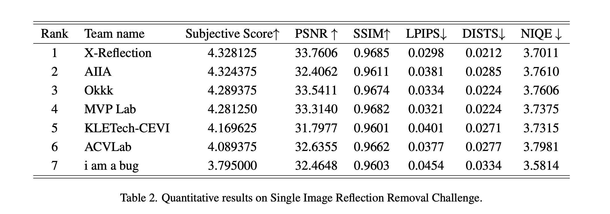

# NTIRE 2025: SIRR in the Wild

## Dataset
The dataset for this challenge is available on Hugging Face 🤗:
[NTIRE2025-SIRR Dataset](https://huggingface.co/datasets/qiuzhangTiTi/NTIRE2025-SIRR)

The dataset contains:
- `train_800.zip`: Contains both Input images and Ground Truth (GT)
- `val_100.zip`: Contains Input images only
- `test_100.zip`: Contains Input images only

## Final Ranking



## 📢 **Repository Renamed**

This repository was previously named **`Reflection-Removal-in-the-Wild`**, and has been renamed to **`OpenRR-1k`** to better reflect its scope as an open benchmark for real-world reflection removal.

All previous links to the old repository name will continue to work via GitHub redirection.


## Citation

If you find our code helpful in your research or work please cite our paper.

```bibtex
@misc{yang2025surveysingleimagereflectionremoval,
      title={Survey on Single-Image Reflection Removal using Deep Learning Techniques}, 
      author={Kangning Yang and Huiming Sun and Jie Cai and Lan Fu and Jiaming Ding and Jinlong Li and Chiu Man Ho and Zibo Meng},
      year={2025},
      eprint={2502.08836},
      archivePrefix={arXiv},
      primaryClass={cs.CV},
      url={https://arxiv.org/abs/2502.08836}, 
}
```
